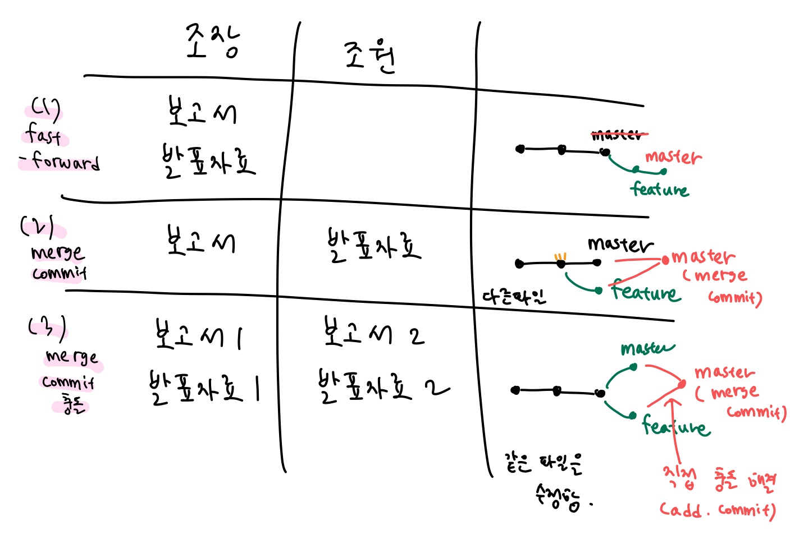

<u>git 간단 정리</u>

**커밋**한 모든 내용은 되돌릴 수 있음.

(커밋하지 않은 내용은 불가)


## Clone

: 다른 사람의 자료를 github에서 가져오고 싶을 때


바탕화면에서 git bash를 연 후, **''$ git clone <주소>''**

- git 저장소를 가지고 오는 것 (모든 버전들을 가져옴)

- clone을 하면, 원격 저장소 이름의 폴더가 생성됨


## Pull

: 새로운 자료가 원격저장소에 업로드 되었을 때, 로컬저장소로 가져오고 싶을 때


**"$ git pull origin master"**

- 변경된 커밋만을 가지고 오는 것


## 🎄Git Flow

Git을 활용하여 협업하는 흐름으로, **branch**를 활용하는 전략을 의미한다.

-branch는 독립적인 버전들이 존재하도록 함


## Git Branch

### 1. branch 관련 명령어

branch를 하기 이전에 root-commit 발생

```bash
$ git init
(master) $ touh README.md
(master) $ git add .
(master) $ git commit -m 'Init'
```

1. 브랜치 목록

   ```bash
   (master) $ git branch
   ```

2. 브랜치 생성

   ```bash
   (master) $ git branch <브랜치명>
   ```

3. 브랜치 이동

   ```bash
   (master) $ git checkout <브랜치명>
   ```

4. 브랜치 생성 및 이동

   ```bash
   (master) $ git checkout -b <브랜치명>
   ```

5. 브랜치 삭제

   ```bash
   (master) $ git branch -d <브랜치명>
   ```

6. 브랜치 병합

   ```bash
   (master) $ git merge <브랜치명>
   ```

   

### 2. branch 병합 시나리오



#### 상황1. fast-forward

- feature 브랜치 생성 이후, master 브랜치에 변경사항이 없는 경우

1. feature/home branch 생성 및 이동

   ```bash
   (master) $ git branch feature/home
   (master) $ git checkout feature/home
   ```

2. 작업 완료 후 commit

   ```bash
   (feature/home) $ touch home.txt
   (feature/home) $ git add .
   (feature/home) $ git commit -m 'Add home.txt'
   ```

3. master 이동

   ```bash
   (feature/home) $ git checkout master
   ```

4. master에 병합

   ```bash
   (master) $ git merge feature/home
   ```

5. branch 삭제

   ```bash
   $ git branch -d feature/home
   ```

#### 상황2. merge commit

- 서로 다른 commit을 병합하는 과정에서 **다른 파일이 수정**되어 있는 상황

1. feature/about branch 생성 및 이동

   ```bash
   (master) $ git branch feature/about
   (master) $ git checkout feature/about
   ```

2. 작업 완료 후 commit

   ```bash
   (feature/about) $ touch test.txt
   (feature/about) $ git add .
   (feature/about) $ git commit -m 'Add test.txt'
   ```

3. master 이동

   ```bash
   (feature/about) $ git checkout master
   ```

4. master에 추가 commit 발생시키기

   - 다른 파일을 수정 혹은 생성

     ```bash
     (master) $ touch new.txt
     (master) $ git add .
     (master) $ git commit -m 'Add new.txt'
     ```

5. master에 병합

   ```bash
   (master) $ git merge feature/about
   ```

6. 결과

   => **자동으로 merge commit 생성**

7. 커밋 및 그래프 확인하기

   ```bash
   $ git log --oneline --graph
   ```

8. branch 삭제

   ```bash
   $ git branch -d feature/about
   ```

#### 상황3. merge commit 충돌

- 서로 다른 commit을 병합하는 과정에서 **같은 파일이 수정**되어 있는 상황

1. feature/test branch 생성 및 이동

   ```bash
   (master) $ git branch feature/test
   (master) $ git checkout feature/test
   ```

2. 작업 완료 후 commit

   ```bash
   #README.md 파일을 열어서 수정
   (feature/test) $ touch test1.txt
   (feature/test) $ git add .
   (feature/test) $ git commit -m 'Add test1.txt'
   ```

3. master 이동

   ```bash
   (feature/test) $ git checkout master
   ```

4. master에 추가 commit 발생시키기

   - 다른 파일을 수정 혹은 생성

     ```bash
     #README.md 파일을 열어서 수정
     (master) $ git add README.md
     (master) $ git commit -m 'Update README.md'
     ```

5. master에 병합

   ```bash
   (master) $ git merge feature/test
   ```

6. 결과

   => **merge conflict 발생**

7. 충돌 원인 및 해결

   => **직접 고치기**

8. merge commit 진행

   ``` bash
   (master|MERGING) $ git add .
   (master|MERGING) $ git commit
   ```

9. 커밋 및 그래프 확인하기

   ```bash
   $ git log --oneline --graph
   ```

10. branch 삭제

    ```bash
    $ git branch -d feature/test
    ```


## 🎄GitHub Flow 기본 원칙

1. master branch는 반드시 배포 가능한 상태여야 한다.
2. feature branch는 각 기능의 의도를 알 수 있도로 작성한다.
3. Commit message는 매우 중요하며, 명확하게 작성한다.
4. Pull Request를 통해 협업을 진행한다.
5. 변경사항을 반영하고 싶다면, master branch에 병합한다.


### Feature Branch Workflow

: 저장소의 소유권이 **있는** 경우


### Forking Workflow

: 저장소의 소유권이 **없는** 경우