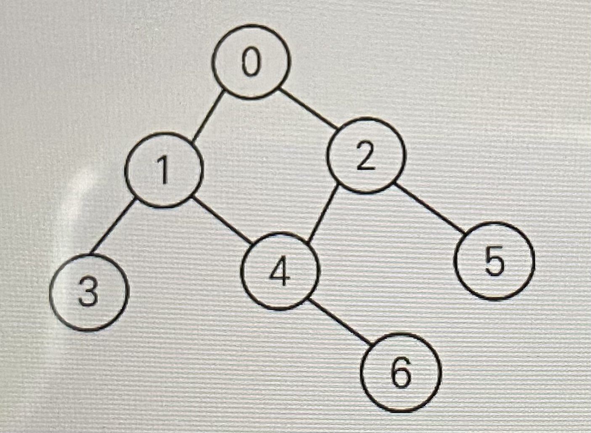
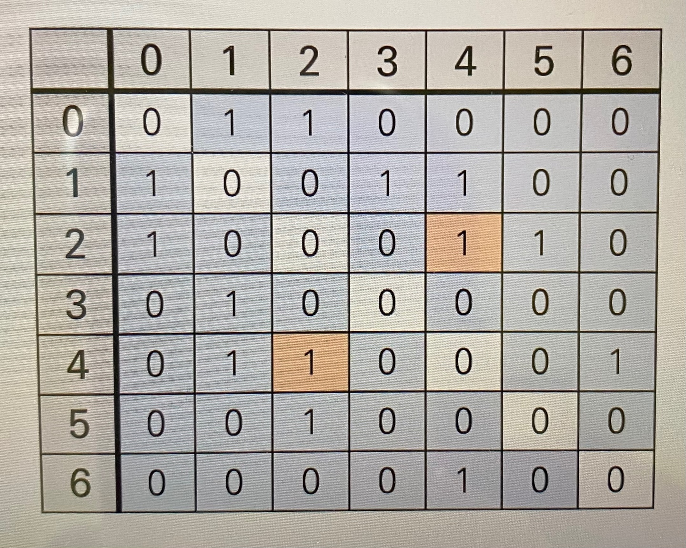
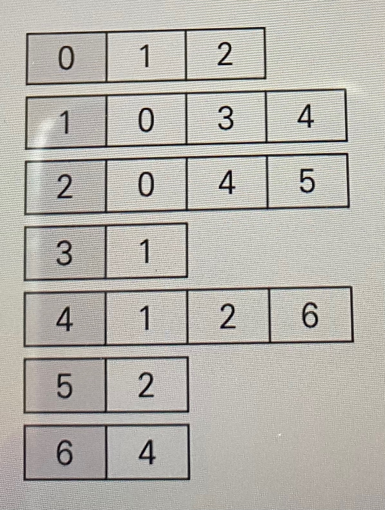

## 그래프

: 정점(vertex)과 이를 연결하는 간선(dege)들의 집합으로 이루어진 비선형 자료구조

- 정점(vertex) : 간선으로 연결되는 객체이며, 노드(Node)라고도 한다.
- 간선(edge) : 정점 간의 관계(연결)를 표현하는 선을 의미한다.
- 경로(path) : 시작 정점부터 도착 정점까지 거치는 정점을 나열한 것을 의미한다.
- 인접(adjacency) : 두 개의 정점이 하나의 간선으로 직접 연결된 상태를 의미한다.


### 그래프의 종류

1) 무방향 그래프(Undirected Graph)
   - 간선의 방향이 없는 가장 일반적인 그래프
   - 간선을 통해 양방향의 정점 이동 가능
   - 차수(degree) : 하나의 정점에 연결된 간선의 개수
   - 모든 정점의 차수의 합 = 간선 수 * 2
2) 유방향 그래프(Directed Graph)
   - 간선의 방향이 있는 그래프
   - 간선의 방향이 가리키는 정점으로 이동 가능
   - 차수(degree) : 진입 차수와 진출 차수로 나누어짐
     - 진입차수(In-degree) : 외부 정점에서 한 정점으로 들어오는 간선 수
     - 진출차수(Out-degree) : 한 정점에서 외부 정점으로 나가는 간선 수


### 그래프의 표현

**[예시]**



```bash
graph = {
	0: [1, 2],
	1: [0, 3, 4],
	2: [0, 4, 5],
	3: [1],
	4: [1, 2, 6],
	5: [2]
	6: [4]
}
#graph[0][0] => 1

graph = {
	[1, 2],
	[0, 3, 4],
	[0, 4, 5],
	[1],
	[1, 2, 6],
	[2],
	[4]
}
#graph[0][0] => 1
```


1. **인접 행렬(Adjacent Matrix)**

   : 두 정점을 연결하는 간선이 없으면 0, 있으면 1을 가지는 행렬로 표현하는 방식

   

```bash
#입력
0 1
0 2
1 3
1 4
2 4
2 5
4 6

#인접 행렬 만들기
n = 7 #정점 개수
m = 7 #간선 개수

graph = [[0] * n for _ in range(n)]

for _ in range(m):
	v1, v2 = map(int, input().split())
	graph[v1][v2] = 1
	graph[v2][v1] = 1
```


2. **인접 리스트(Adjacent List)**

   : 리스트를 통해 각 정점에 대한 인접 정점들을 순차적으로 표현하는 방식

   

```bash
#입력
0 1
0 2
1 3
1 4
2 4
2 5
4 6

#인접 리스트 만들기
n = 7 #정점 개수
m = 7 #간선 개수

graph = [[] for _ in range(n)]

for _ in range(m):
	v1, v2 = map(int, input().split())
	graph[v1].append(v2)
	graph[v2].append(v1)
```