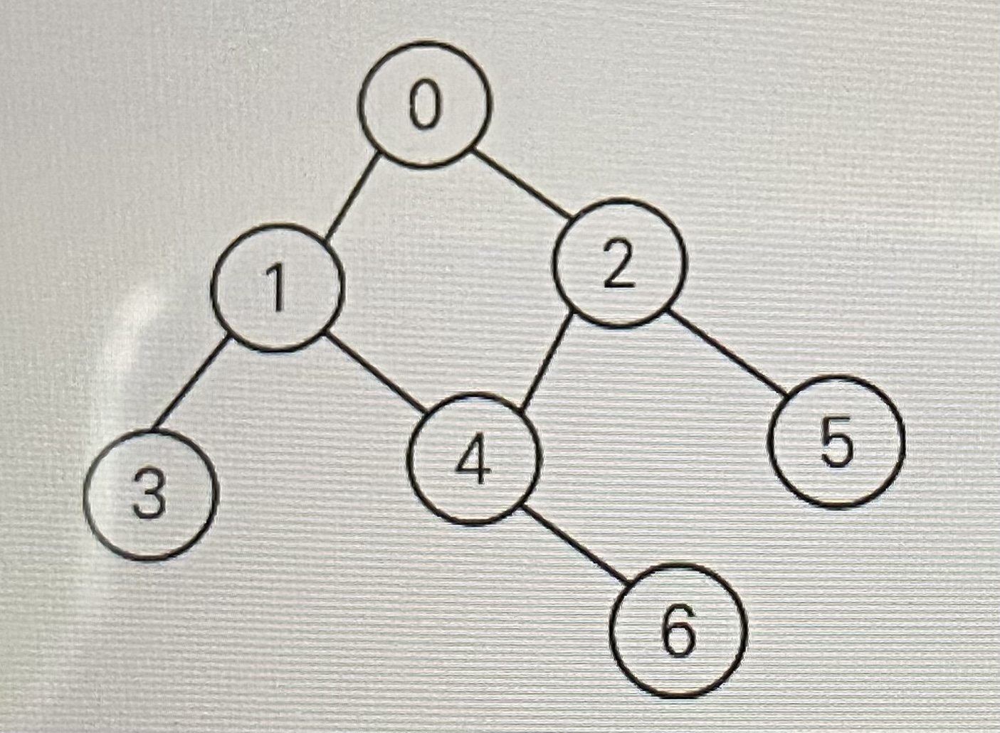

## 그래프 탐색 알고리즘

시작 정점에서 간선을 타고 이동할 수 있는 모든 정점을 찾는 알고리즘


### 깊이 우선 탐색(DFS)

=> stack의 개념을 활용

- 시작 정점으로부터 갈 수 있는 하위 정점까지 가장 깊게 탐색하고, 더 이상 갈 곳이 없다면 마지막 갈림길로 돌아와서 다른 정점을 탐색하며 결국 모든 정점을 방문하는 순회 방법 

- 모든 정점을 방문할 때 유리 / 경우의 수, 수열과 조합 문제에서 많이 사용
- 너비우선탐색(BFS)에 비해 코드 구현이 간단
- 단, 모든 정점을 방문할 필요가 없거나 최단 거리를 구하는 경우에는 너비우선탐색(BFS)이 유리하다.


### DFS의 동작 과정

- DFS를 하기 전에, 일단 탐색을 진행할 그래프가 필요하다.
  - 그래프는 인접 행렬 혹은 인접 리스트 방식으로 표현할 수 있다.

- 각 정점을 방문했는지 여부를 판별할 방문 체크 리스트가 필요하다.

  - ```bash
    visited = [False] * n	#n은 정점의 개수
    						#방문한 정점은 True
    ```

**[DFS의 사이클]**

1. 현재 정점 방문처리
2. 인접한 모든 정점 확인
3. 방문하지 않은 인접 정점 이동


### DFS 구현 방식



1. 그래프를 인접 리스트로 구성

   ```bash
   graph = [
   	[1, 2],
   	[0, 3, 4],
   	[0, 4, 5],
   	[1],
   	[1, 2, 6],
   	[2],
   	[4]
   ]
   ```

2. 반복문을 이용한 DFS (스택 사용)

   ```bash
   visited = [False] * n #방문 처리 리스트 만들기
   
   def dfs(start):
   	stack = [start] #돌아갈 곳을 기록
   	visited[start] = True #시작 정점 방문 처리
   
   	while stack: #스택이 빌 때까지 반복
   		cur = stack.pop() #현재 방문 정점(후입선출)
   	
   		for adj in graph[cur]: #인접한 모든 정점에 대해
   			if not visited[adj]: #아직 방문하지 않았다면
   				visited[adj] = True #방문 처리
   				stack.append(adj) #스택에 넣기
   				
   dfs(0) #0번 정점에서 시작
   ```