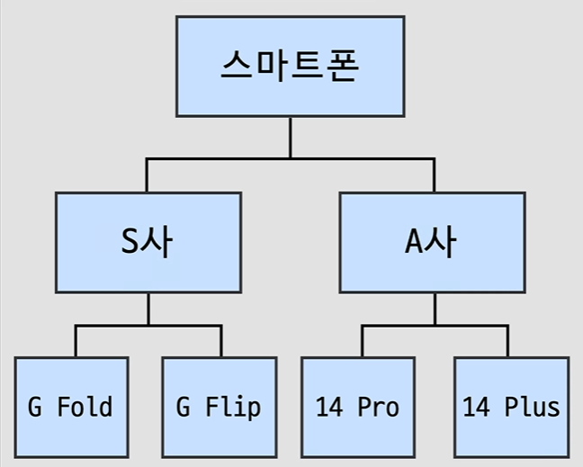
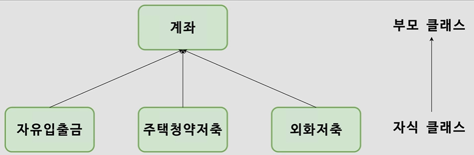

## 객체지향


- 객체지향 프로그래밍

  

  - 속성 : 정적인 정보를 다룸 (스마트폰이 가지는 기본적 속성)

    => 멤버 변수

  - 기능 : 작업을 수행하는 동적인 액션 (회사 및 휴대폰 종류에 따라 기능이 다름)

    => 메서드(함수)

  - 클래스 : 스마트폰을 설계하는 역할
  - 인스턴스 : 설계도로부터 스마트폰이 생성까지 이루어지는 것


- 클래스

  - BankAccount

    ```java
    public class BankAccount {
    
        //멤버변수(정적)
        //BankAccount 클래스는 6가지 멤버변수를 가짐
        int bankCode;
        int accountNo;
        String owner;
        int balance;
        boolean isDormant;
        int password;
    
        //메서드(동적)
        void inquiry() {}
        void deposit() {}
        void withdraw() {}
        void heldInDormant() {}
    
        //생성자
        //클래스 내부에 정의, 생성자 메서드명은 클래스명과 일치!
        //new 연산자와 함께 사용
    
        //생성자를 직접 만들어주지 않으면, 이처럼 빈 생성자가 생성됨
        //빈 생성자가 필요한 경우에는 아래처럼 직접 만들어주면 됨
        BankAccount() {
    
        }
        BankAccount (
                int bankCode,
                int accountNo,
                String owner,
                int balance,
                int password,
                boolean isDormant
        ) {
            //this: 인스턴스 자기자신을 가리킴
            this.bankCode = bankCode;
            this.accountNo = accountNo;
            this.owner = owner;
            this.balance = balance;
            this.password = password;
            this.isDormant = isDormant;
        }
    }
    ```

  - ClassExample

    ```java
    public class ClassExample {
    
        public static void main(String[] args) {
    
            BankAccount account = new BankAccount();
            System.out.println(account);
            System.out.println(account.bankCode);
            System.out.println(account.isDormant);
        }
    }
    ```

    

- 상속

  

  - 공통속성(계좌)의 변경사항을 그 아래 자식요소들에 한번에 적용

    - 이때, 상속받을 때 하나의 클래스만 상속받을 수 있다! (단일상속)

  - SavingsAccount

    ```java
    public class SavingsAccount extends BankAccount{
        //부모의 속성을 가지고 시작
    
        //해당 자식만 가지는 멤버변수와 메서드를 추가
        boolean isOverdraft;
        void transfer() {}
    }
    ```

  - DollarAccount

    ```java
    public class DollarAccount extends BankAccount {
    
        void transfer() {}
    }
    ```

  - SubscriptionAccount

    ```java
    public class SubscriptionAccount extends BankAccount {
    
        int numOfSubscription;
    }
    ```

  - 오버로딩/오버라이딩

    ```java
    public class DollarAccount extends BankAccount {
    
        //오버로딩 => 부모 클래스에서 상속받은 메서드에서 파라미터를 변경
        //새로운 메서드 정의!
        void inquiry(double currencyRate) {}
        
        //오버라이딩 => 부모 클래스에서 상속받은 메서드의 내용 변경
        //자식 클래스의 상황에 맞게
        void deposit() {
            //파라미터가 아니라 중괄호 부분을 변경하는 것임!
        }
    }
    ```


- 접근 제어자

  - 클래스, 멤버변수, 메서드, 생성자 .. 에 접근을 제어하는 것

  - 접근 제어자가 설정되어 있지 않으면, 아무나 인스턴스의 값을 변경 가능

    ```java
    public class ClassExample {
    
        public static void main(String[] args) {
    
            BankAccount account = new BankAccount();
            System.out.println(account);
            System.out.println(account.bankCode);
            System.out.println(account.isDormant);
    
            BankAccount bankAccount = new BankAccount();
            bankAccount.password = 123456;
            //값이 123456으로 변경됨
            System.out.println(bankAccount.password);
        }
    }
    ```

    => 멤버변수들은 인스턴스의 속성이기 때문에 각각의 역할에 맞는 함수를 만들어서 변경시켜야 함!

    => 각각의 멤버변수의 값을 외부에서 함부로 변경할 수 없도록 자물쇠를 잠구어야함!

  - 메서드 같은 경우에는 외부에서 사용하기 때문에 public으로 하는 경우가 많지만, 멤버변수 자체는 private으로 설정함

    ```java
    public class BankAccount {
    
        //멤버변수(정적)
        //BankAccount 클래스는 6가지 멤버변수를 가짐
        private int bankCode;
        private int accountNo;
        private String owner;
        private int balance;
        private boolean isDormant;
        private int password;
    
        //메서드(동적)
        public void inquiry() {}
        public void deposit() {}
        public void withdraw() {}
        public void heldInDormant() {}
        //private => 동일 클래스 안에서만 참조 및 수정 가능
        public void changePassword (int password) {
            this.password = password;
        }
    
        //생성자
        //클래스 내부에 정의, 생성자 메서드명은 클래스명과 일치!
        //new 연산자와 함께 사용
    
        //생성자를 직접 만들어주지 않으면, 이처럼 빈 생성자가 생성됨
        //빈 생성자가 필요한 경우에는 아래처럼 직접 만들어주면 됨
        BankAccount() {
    
        }
        BankAccount (
                int bankCode,
                int accountNo,
                String owner,
                int balance,
                int password,
                boolean isDormant
        ) {
            //this: 인스턴스 자기자신을 가리킴
            this.bankCode = bankCode;
            this.accountNo = accountNo;
            this.owner = owner;
            this.balance = balance;
            this.password = password;
            this.isDormant = isDormant;
        }
    }
    ```

  - private을 걸어두면 수정도 안되지만, 참조도 안됨!

    ```java
    public class ClassExample {
    
        public static void main(String[] args) {
    
            BankAccount account = new BankAccount();
            System.out.println(account);
    //        System.out.println(account.bankCode);
    //        System.out.println(account.isDormant);
    
    //        BankAccount bankAccount = new BankAccount();
    //        bankAccount.password = 123456;
    //        System.out.println(bankAccount.password);
    
            BankAccount bankAccount = new BankAccount();
            bankAccount.changePassword(123456);
            System.out.println(bankAccount.password);
        }
    }
    ```

    => 에러가 뜸 !! 수정 뿐 아니라 조회도 안됨

    => 값을 조회하고 수정하기 위한 특별한 함수들을 정의해야함

    => 벡터와 섹터