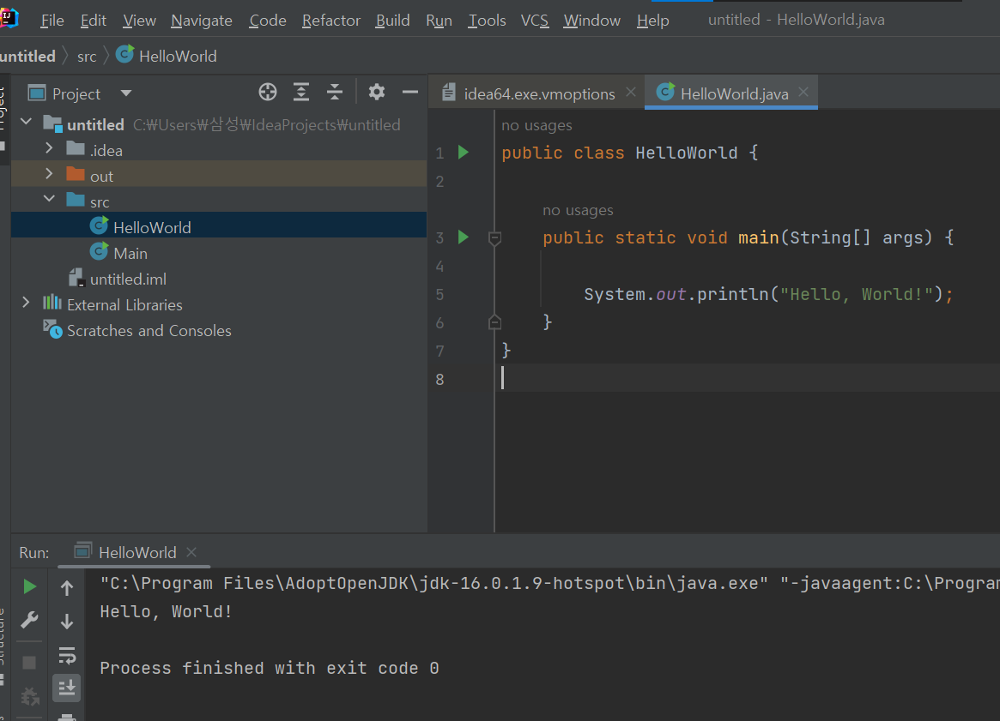

## 변수와 자료형


- Hello, World! 출력하기
  - src -> new -> Java Class : HelloWorld파일생성
  - main -> System.out.println("Hello, World!");




- 변수

  ```java
  public class Variables {
  
      //변수 => 데이터가 저장되는 공간
  
      //1. 1개의 변수 => 1개의 값만 할당 가능
      //2. 변수에 저장된 값 => 재할당을 통해 변경 가능
      //3. 값의 형태에 맞는 자료형을 사용
      //4. 변수명은 소문자로 시작
      //5. 대소문자 구분, 공백 포함 불가능
      //6. 자바 예약어 사용 불가
  
      public static void main(String[] args) {
          int num = 1;
          double width = 12.34;
          String content = "Programming";
  
          num = 10;
          System.out.println(num);
          
      }
  }
  ```


- 기본형

  ```java
  public class PrimitiveType {
  
      public static void main(String[] args) {
  
          //정수형
          //1. byte(1 byte = 8 bits): -2^7 ~ 2^7-1(-128 ~ 127)
          //2. short(2 bytes): -2^15 ~ s^15-1(-32,768 ~ 32,767)
          //3. int(4 bytes): -2^31 ~ 2^31-1
          //4. long(8 bytes): -2^63 ~ 2^63-1
  
          //실수형
          //1. double(8 bytes): 소수점 이하 15자리까지
          //2. float(4 bytes): 소수점 이해 7자리까지
  
          double a = 1.23;
          float b = 9.45f; //마지막에 f를 붙여줘야함
  
          System.out.println(a);
          System.out.println(b);
  
          //문자형
          //char(2 bytes)
  
          char char_1 = 'a';
          char char_2 = 97;
          char char_3 = 43;
          char char_4 = 0x61;
  
          System.out.println(char_1);
          System.out.println(char_2); //'a'가 출력됨 => 아스키코드
          System.out.println(char_3); //'+'가 출력됨 => 아스키코드
          System.out.println(char_4); //'a'가 출력됨 => 유니코드
  
          //논리형
          //boolean(1 byte)
  
          boolean bool_1 = true;
          boolean bool_2 = false;
          boolean bool_3 = (100 < 0);
          // boolean bool_4 = 1 이렇게는 불가능함
  
          System.out.println(bool_1);
          System.out.println(bool_2);
          System.out.println(bool_3);
      }
  }
  ```


- 참조형

  ```java
  public class ReferenceType {
  
      public static void main(String[] args) {
  
          //참조형
          //참조형 데이터의 값 => 힙 메모리 영역
          //변수에 대입되는 값 => 힙 메모리 영역의 주소값
  
          String a = new String("Hello!");
          System.out.println(a);
  
          String b = "Hello!";
          String c = "Hello!";
  
          if (a == b) {
              System.out.println("a == b");
              //출력되지 않음 => a와 b의 주소값이 다름
              //힙 메모리에 동일한 데이터가 있건 없건 생성함
          }
  
          if (b==c) {
              System.out.println("b == c");
              //출력됨 => b와 c의 주소값이 같음
              //힙 메모리 내의 동일한 데이터를 활용하기 위해 주소를 동일하게 가져감
          }
  
      }
  }
  ```


- 상수

  ```java
  public class Constants {
  
      public static void main(String[] args) {
  
          //상수(constants, final variables)
          //한 번 값이 할당 => 재할당이 불가능
          //전체를 대문자, 단어간 구분은 _
  
          final double PI_VALUE = 3.14;
          System.out.println(PI_VALUE);
  
          //PI_VALUE = 3.141592; => 할당 불가능
      }
  }
  ```


- 형변환

  ```java
  public class TypeCasting {
  
      public static void main(String[] args) {
  
          //형변환
          //byte < short < int < long <<< float < double
  
          //강제 형변환
          int a = 128;
          short b = (short) a;
          byte c = (byte) a;
  
          System.out.println(a);
          System.out.println(b);
          System.out.println(c); //-128 출력 => overflow 발생
  
          //자동 형변환
          short x = 10;
          int y = x;
  
          System.out.println(x);
          System.out.println(y);
  
          int m = 80;
          double n = m;
  
          System.out.println(m);
          System.out.println(n);
  
          double d = 10.33124546435;
          float e = (float) d;
  
          System.out.println(d);
          System.out.println(e);
  
          int f = 10;
          short g = 20;
  
          short h = (short) (f + g);
          System.out.println(h);
      }
  }
  ```


- String

  ```java
  public class StringExample {
  
      public static void main(String[] args) {
  
          //String => 문자열 객체
          //객체 => 힙 메모리 영역
          //변수 => 힙 메모리 영역의 주소
  
          String str_1 = "안녕하세요!"; //문자열 리터럴
          String str_2 = new String("안녕하세요!"); //생성자
          String str_3 = "안녕하세요!";
  
          //주소값을 비교
          if (str_1 == str_2) {
              System.out.println("str1 == str2");
          }
  
          if (str_1 == str_3) {
              System.out.println("str1 == str3");
          }
  
          if (str_2 == str_3) {
              System.out.println("str2 == str3");
          }
  
          //내용 자체를 비교
          if (str_1.equals(str_2)) {
              System.out.println("str_1.equals(str_2)");
          }
  
          if (str_1.equals(str_3)) {
              System.out.println("str_1.equals(str_3)");
          }
  
          if (str_2.equals(str_3)) {
              System.out.println("str_2.equals(str_3)");
          }
  
          //문자열 병합
  
          //1. '+' 연산자
          String str1 = "Hello,";
          String str2 = "World!";
  
          System.out.println(str1 + " " + str2);
  
          //2. StringBuilder
          StringBuilder strBdr_1 = new StringBuilder("Hello,");
  
          strBdr_1.append(" ");
          strBdr_1.append("World!");
  
          String str_new = strBdr_1.toString();
  
          System.out.println(str_new);
  
          //문자열 슬라이스
          String string_1 = "이름: 김자바";
          System.out.println(string_1.indexOf("이"));
          System.out.println(string_1.indexOf("름"));
  
          String str_name = string_1.substring(4, 7);
          System.out.println(str_name);
  
          //문자열 대소문자 반환
          String string_2 = "abc";
          String string_3 = "ABC";
  
          string_2 = string_2.toUpperCase();
          string_3 = string_3.toLowerCase();
  
          System.out.println(string_2);
          System.out.println(string_3);
  
          if (string_2.equals(string_3)) {
              System.out.println("string_2.equals(string_3)");
          }
  
          if (string_2.equalsIgnoreCase(string_3)) {
              //대소문자를 무시하고 값을 비교
              System.out.println("(string_2.equalsIgnoreCase(string_3))");
          }
  
          //공백 제거
  
          //1. 양쪽 끝 공백
          String str_ex1 = "  Hello   ";
          str_ex1 = str_ex1.trim();
          System.out.println(str_ex1);
  
          //2. 문자열 중간 공백
          String str_ex2 = "  Hel lo  ";
          str_ex2 = str_ex2.replace(" ", "");
          System.out.println(str_ex2);
      }
  }
  ```

  
