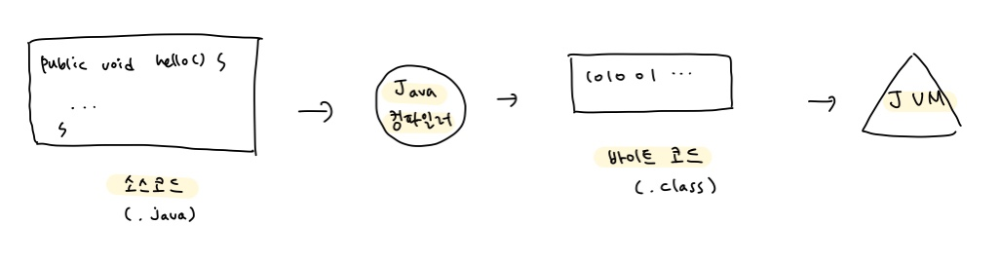

### 자바 LTS(Long-Term Support)

- 장기 유지 보수 및 보안 패치 지원 버전

- 안정적인 프로그램 개발을 위해 사용 권장

### JDK, JRE

- **JVM** (Java Virtual Machine) : Java 프로그램이 실행되는 가상의 공간

- **JRE** (Java Runtime Environment) : Java로 컴파일 된 프로그램을 실행

- **JDK** (Java Development Kit) : Java 어플리케이션 개발을 위해 반드시 필요. Java 컴파일러와 JRE 포함
