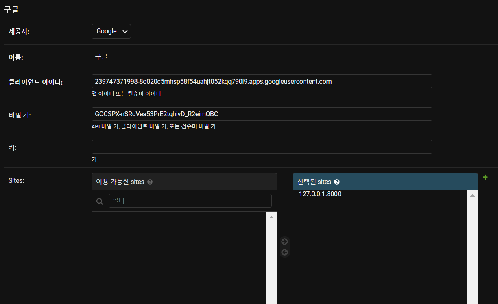

## 소셜 로그인 기능 구현


**(구글 로그인)**

- django-allauth 패키지 설치

  ```bash
  pip install django-allauth
  ```

- settings.py 수정

  - installed_apps에 추가 / sites, allauth, provider
  - authentication_backends 추가

  ```python
  #pjt/settings.py
  
  INSTALLED_APPS = [
      'reviews',
      'stores',
      'accounts',
      'django_bootstrap5',
      'django_extensions',
      'imagekit',
      'django.contrib.admin',
      'django.contrib.auth',
      #sites 추가해주기
      'django.contrib.sites'
      'django.contrib.contenttypes',
      'django.contrib.sessions',
      'django.contrib.messages',
      'django.contrib.staticfiles',
      'phonenumber_field',
      
      #allauth
      'allauth',
      'allauth.account',
      'allauth.socialaccount',
      
      #provider
      'allauth.socialaccount.providers.google'
  ]
  
  
  #settings.py 맨 아래에 추가
  AUTHENTICATION_BACKENDS = (
      'django.contrib.auth.backends.ModelBackend',
  
      'allauth.account.auth_backends.AuthenticationBackend'
  )
  
  SITE_ID = 1
  LOGIN_REDIRECT_URL = '/'
  ```

- urls.py 연결

  ```python
  #pjt/urls.py
  
  urlpatterns = [
      path('admin/', admin.site.urls),
      #allauth에는 url 설정이 기본적으로 다 되어있음
      path('social-login/', include('allauth.urls')),
      path('accounts/', include('accounts.urls')),
      path('reviews/', include('reviews.urls')),
      path('stores/', include('stores.urls')),
  ] + static(settings.MEDIA_URL, document_root=settings.MEDIA_ROOT)
  ```

- migrate 해주기

  ```bash
  python manage.py migrate
  ```

- admin 페이지에서 sites 바꿔주기

  - example.com을 **127.0.0.1:8000**로 바꿔주기

  

  

- [http://console.developers.google.com](http://console.developers.google.com/)접속

  - 새 프로젝트 생성 -> 사용자 인증 정보 만들기 -> OAuth 클라이언트 ID -> 동의 화면 구성 -> 웹 어플리케이션 -> url 추가

    

    -> 만들기

- admin 페이지 - Social Accounts > Social applications > Add social application

  - id와 key를 admin 페이지에 복붙하고, sites의 주소를 clone shites로 넘겨주기

    

- login.html 수정

  ```html
  <!-- accounts/login.html -->
  
  
  
  <!-- socialaccount와 provider_medi_js 가져오기 -->
  
  
  
  
  
  
  
  
  
  <form action="" method="POST">
      
      
      
  </form>
  
  <!-- 구글 로그인 연결 -->
  <a href="">구글 로그인</a>
  
  
  ```

  


### 하려고 했으나 포기 !

=> **자바스크립트**를 활용해서 소셜 로그인을 한 후, **데이터베이스**에 저장해주고 **로그인**해줌


참고)

자바스크립트 카카오 로그인
https://shanepark.tistory.com/67

자바스크립트 네이버 로그인
https://shanepark.tistory.com/66

