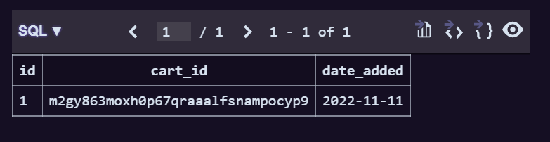
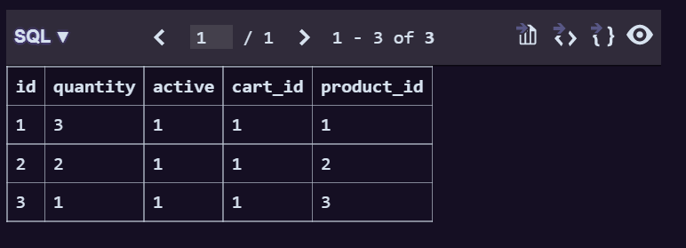

## 장바구니 CRUD API


참고 사이트 : https://citylock77.tistory.com/45


1. Cart 앱 생성하기 및 INSTALLED_APPS에 등록

2. cart 관련 모델 생성하기

   ```python 
   #cart/models.py
   
   from django.db import models
   from products.models import Products
   
   class Cart(models.Model):
       cart_id = models.CharField(max_length=250, blank=True)
       date_added = models.DateField(auto_now_add=True)
   
       class Meta:
           db_table = 'Cart'
           ordering = ['date_added']
   
       def __str__(self):
           return self.cart_id
   
   class CartItem(models.Model):
       product = models.ForeignKey(Products, on_delete=models.CASCADE)
       cart = models.ForeignKey(Cart, on_delete=models.CASCADE)
       quantity = models.IntegerField()
       active = models.BooleanField(default=True)
   
       class Meta:
           db_table = 'CartItem'
   
       def sub_total(self):
           return self.product.cost * self.quantity
   
       def __str__(self):
           return self.product
   ```

   -> makemigrations 해주기

3. cart view 생성하기

   ```python
   #cart/views.py
   
   from django.shortcuts import render, redirect
   from products.models import Products
   from .models import Cart, CartItem
   from django.core.exceptions import ObjectDoesNotExist
   
   def _cart_id(request):
       #각 상품에 대해 유저의 session_key가 있는지 확인
       cart = request.session.session_key
       if not cart:
           cart = request.session.create()
       return cart
   
   def add_cart(request, product_id):
       #장바구니에 들어가는 product
       product = Products.objects.get(id=product_id)
       try:
           #해당 상품에 유저의 session_key가 있는지 확인하고
           cart = Cart.objects.get(cart_id=_cart_id(request))
       #cart가 없다면,
       except Cart.DoesNotExist:
           cart = Cart.objects.create(
               cart_id = _cart_id(request)
           )
           cart.save()
   
       #cart_item이 있는지 없는지 여부 확인
       try:
           cart_item = CartItem.objects.get(product=product, cart=cart)
           cart_item.quantity += 1
           cart_item.save()
       except CartItem.DoesNotExist:
           cart_item = CartItem.objects.create(
               product = product,
               quantity = 1,
               cart = cart
           )
           cart_item.save()
       return redirect('cart:cart_detail')
   
   #counter=0 : 루프가 입력된 횟수(인덱스)
   def cart_detail(request, total=0, counter=0, cart_items=None):
       try:
           cart = Cart.objects.get(cart_id=_cart_id(request))
           cart_items = CartItem.objects.filter(cart=cart, active=True)
           for cart_item in cart_items:
               total += (cart_item.product.cost * cart_item.quantity)
               counter += cart_item.quantity
       except ObjectDoesNotExist:
           pass
   
       return render(request, 'cart/cart.html', {'cart_items': cart_items, 'total': total, 'counter': counter})
   ```

4. cart.html 만들기

   ```html
   <!-- cart/cart.html -->
   
   
   
   
   
   
   
       
           <h1>장바구니가 비었습니다.</h1>
       
           <h1>장바구니</h1>
           
               {{ cart_item.product.name }}
           
       
   
   
   ```

5. urls 만들기

   ```python
   from django.urls import path
   from . import views
   
   app_name = 'cart'
   
   urlpatterns = [
       path('add/<int:product_id>', views.add_cart, name='add_cart'),
       path('', views.cart_detail, name='cart_detail')
   ]
   ```

6. add_cart로 연결되는 버튼 생성

   ```html
   <!-- products/detail.html -->
   
   <a class="btn btn-secondary" href="">장바구니 담기</a>
   ```


[생성된 데이터베이스]

- Cart

  

- CartItem

  


## 최종본 (내가 구현한 방법)

다른 사이트를 참고해서 한다고 했는데 생각해보니까 Cart 테이블이 있어야 할 이유가 없었다. 그래서 직접 모델링을 새로 하고 다시 구현해 보았다.


1. cart 앱 생성 및 url 연결

2. cart 모델 생성

   ```python
   from django.db import models
   from products.models import Products
   from accounts.models import User
   
   class CartItem(models.Model):
       user = models.ForeignKey(User, on_delete=models.CASCADE)
       product = models.ForeignKey(Products, on_delete=models.CASCADE)
       quantity = models.IntegerField()
   
       class Meta:
           db_table = 'CartItem'
   
       def sub_total(self):
           return self.product.cost * self.quantity
   
       def __str__(self):
           return self.product
   ```

   => cart 모델에는 간단하게 user와 product, quantity를 두었다.

3. cart view 생성

   ```python
   from django.shortcuts import render, redirect
   from products.models import Products
   from .models import CartItem
   from django.core.exceptions import ObjectDoesNotExist
   from django.contrib.auth.decorators import login_required
   
   @login_required
   def add_cart(request, product_id):
       if request.method == "POST":
           cart_quantity = request.POST["cart_quantity"]
           print(cart_quantity)
       # 장바구니에 들어가는 product
       product = Products.objects.get(id=product_id)
   
       # cart_item이 있는지 없는지 여부 확인
       try:
           cart_item = CartItem.objects.get(product=product, user=request.user)
           cart_item.quantity += int(cart_quantity)
           cart_item.save()
       except CartItem.DoesNotExist:
           cart_item = CartItem.objects.create(
               product=product, quantity=int(cart_quantity), user=request.user
           )
           cart_item.save()
       return redirect("cart:cart_detail")
   
   # counter=0 : 루프가 입력된 횟수(인덱스)
   @login_required
   def cart_detail(request, total=0, counter=0, cart_items=None):
       try:
           cart_items = CartItem.objects.filter(user=request.user)
           for cart_item in cart_items:
               total += cart_item.product.cost * cart_item.quantity
               counter += cart_item.quantity
       except ObjectDoesNotExist:
           pass
   
       return render(
           request,
           "cart/cart.html",
           {"cart_items": cart_items, "total": total, "counter": counter},
       )
   
   @login_required
   def delete_cart(request, product_id):
       cart_item = CartItem.objects.get(id=product_id, user=request.user)
       cart_item.delete()
       return redirect("cart:cart_detail")
   
   @login_required
   def clear_cart(request):
       cart_items = CartItem.objects.get(user=request.user)
       cart_items.delete()
       return redirect("cart:cart_detail")
   ```

4. cart.html 생성

   ```html
   
   
   
   
   
   
       
           <h1>장바구니가 비었습니다.</h1>
       
           <h1>장바구니</h1>
           
               <div style="display:flex; flex-direction:column; border:1px solid black;">
                   <p>제품명 : <a href="">{{ cart_item.product.name }}</a></p>
                   <p>개수 : {{ cart_item.quantity }}</p>
                   <p>총 가격 : {{ cart_item.product.cost }}원 X {{ cart_item.quantity }} = {{ cart_item.sub_total }}원</p>
                   <a class="btn btn-danger" href="">장바구니에서 삭제하기</a>
               </div>
           
       
       <h1>총 물건 개수 : {{ counter }}개</h1>
       <h1>총 가격 : {{ total }}원</h1>
       <a class="btn btn-primary" href="">장바구니 비우기</a>
   
   
   ```

   